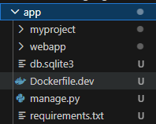
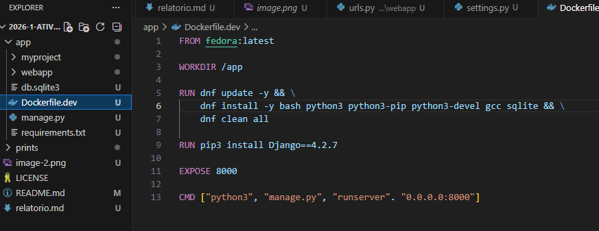
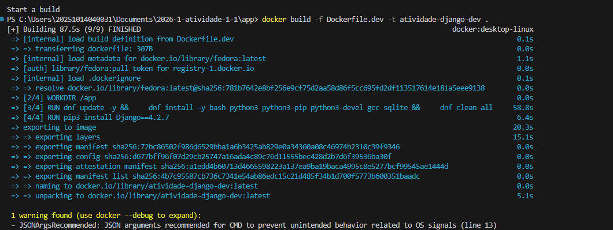
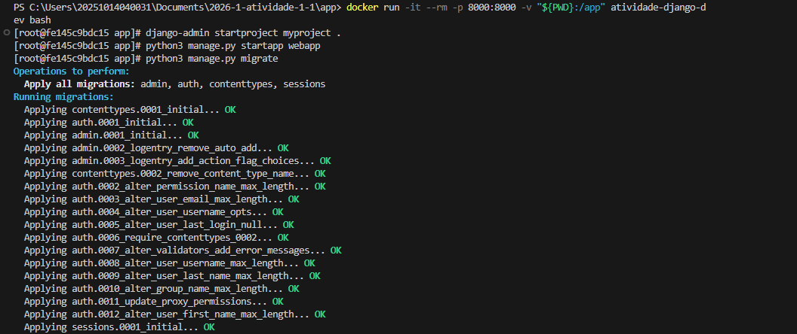
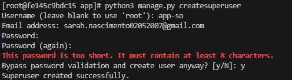
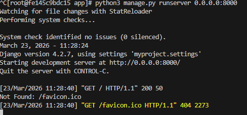
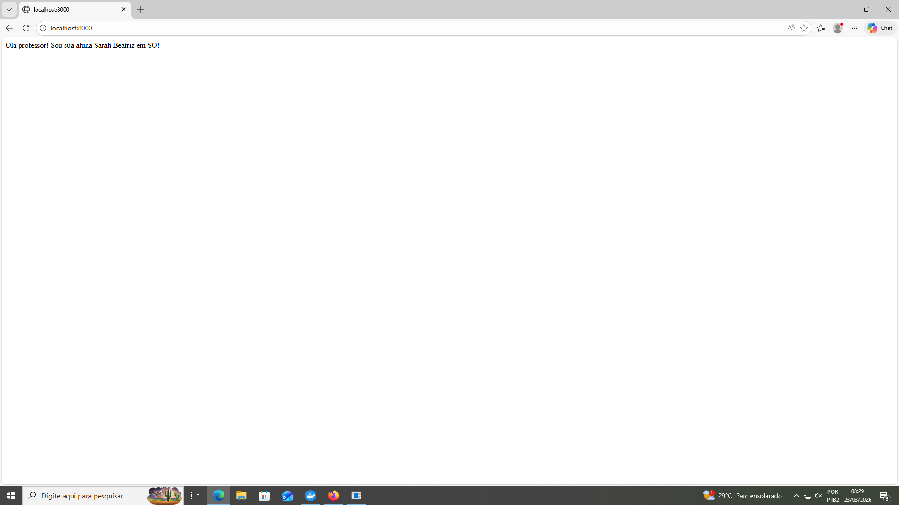
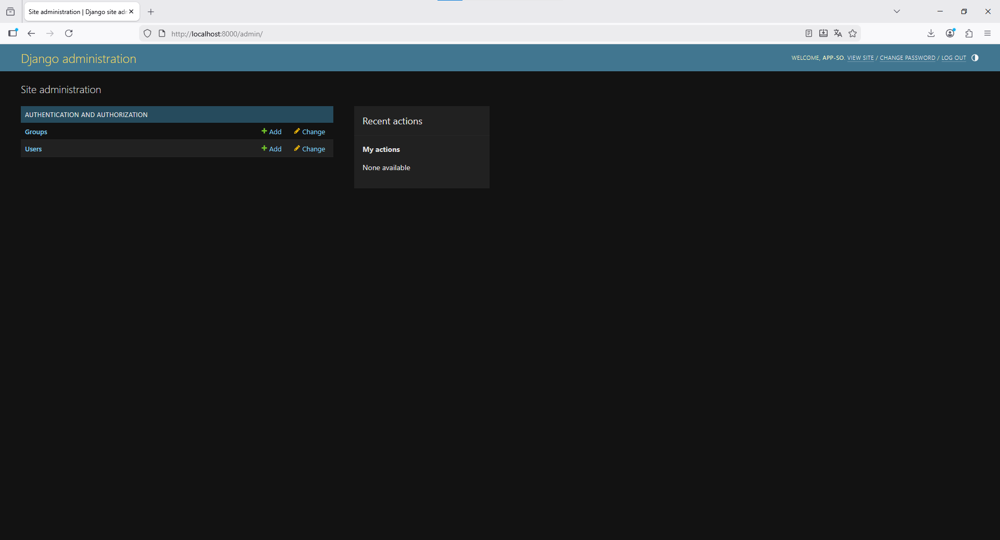

# Relatório da atividade avaliativa de Sistemas Operacionais
# Estudante: Sarah Beatriz Barbosa do Nascimento

## Introdução
O seguinte relatório tem como objetivo apresentar a atividade que fiz na disciplina de Sistemas Operacionais. O exercício consistiu na criação de um container Docker para rodar uma aplicação feita em Django, com mapeamento de portas e volume.

## Relato das Atividades
**1 .** Inicialmente, fiz o fork do repositório disponibilizado pelo professor


**2.** Clonei o repositório para minha máquina local


**3.** Criei a pasta ```/app``` junto com o arquivo ```requirements.txt```




**4.** Criei o arquivo ```Dockerfile.dev``` e inseri os comandos para a criação da imagem



**5.** Construí a imagem



**6.** Executei o docker com volume mapeado, iniciei o projeto ```myproject``` e criei a aplicação ```webapp```



**7.** Criei um superusuário



**8.** Executei a aplicação



**9.** Página ```home``` rodando



**10.** Página de  ```admin``` rodando



## Considerações finais
Concluo nessas considerações finais que aprendi um pouco mais sobre o framework Django e como rodá-lo em um container, mesmo lidando com erros comuns de esquecimento da minha parte (ex: esquecer de incluir um método no ```import``` na hora de mapear as URLs). Contudo, no geral, tudo funcionou perfeitamente e não tive dificuldades muitos grandes para lidar, pois o tutorial é bem claro, sucinto e simples de compreender.

Não tenho nenhuma sugestão para dar. O método de avaliação utilizado nessa disciplina é bom, visto que o aluno tem o tutorial em mãos, mas ainda sim erra e aprende com os erros.